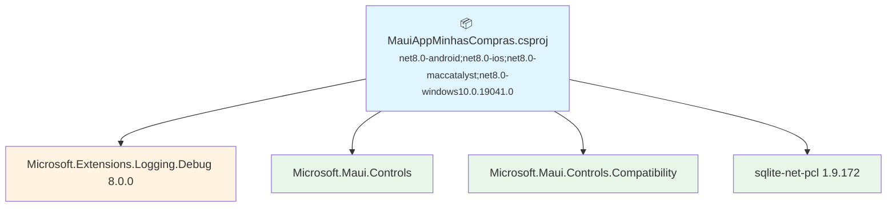

# .NET 10.0 Upgrade Plan

## Table of Contents

- [Executive Summary](#executive-summary)
- [Migration Strategy](#migration-strategy)
- [Detailed Dependency Analysis](#detailed-dependency-analysis)
- [Project-by-Project Plans](#project-by-project-plans)
- [Package Update Reference](#package-update-reference)
- [Breaking Changes Catalog](#breaking-changes-catalog)
- [Risk Management](#risk-management)
- [Testing & Validation Strategy](#testing--validation-strategy)
- [Complexity & Effort Assessment](#complexity--effort-assessment)
- [Source Control Strategy](#source-control-strategy)
- [Success Criteria](#success-criteria)

---

## Executive Summary

### Scenario Description

This plan outlines the upgrade of **MauiAppMinhasCompras** from **.NET 8.0** to **.NET 10.0 (LTS)**. The upgrade is necessary as .NET 8 reached end-of-support on May 14, 2025, leaving the application without security updates or bug fixes.

### Scope

**Projects Affected:** 1 project
- **MauiAppMinhasCompras.csproj** - .NET MAUI cross-platform application

**Current State:**
- Target Frameworks: `net8.0-android`, `net8.0-ios`, `net8.0-maccatalyst`, `net8.0-windows10.0.19041.0`
- 4 NuGet packages (1 requires update)
- 281 lines of code across 17 files
- SDK-style project
- No project dependencies

### Target State

- Target Frameworks: `net10.0-android`, `net10.0-ios`, `net10.0-maccatalyst`, `net10.0-windows10.0.19041.0`
- Updated package: Microsoft.Extensions.Logging.Debug 8.0.0 → 10.0.3
- Compatible with .NET MAUI 10 workload
- Long-term support until November 14, 2028

### Selected Strategy

**All-At-Once Strategy** - All target frameworks and packages upgraded simultaneously in single operation.

**Rationale:**
- Single project (simple solution)
- No internal dependencies to coordinate
- Clean dependency structure with no conflicts
- All packages have compatible target framework versions
- Low complexity (281 LOC, 0 API issues)
- Assessment shows low difficulty rating

### Complexity Assessment

**Solution Classification: Simple**

**Key Metrics:**
- 1 project
- Dependency depth: 0 (no project dependencies)
- Risk indicators: None (no high-risk projects, no security vulnerabilities)
- API compatibility: 64 compatible APIs, 0 incompatible
- Code impact: 0+ LOC estimated modifications (0.0% of codebase)

**Iteration Strategy:** Fast batch approach
- Phase 1-2: Foundation (3 iterations) ✅
- Phase 3: Single iteration for all project details (low complexity)

### Critical Issues

**None identified.** This is a straightforward upgrade with:
- ✅ No security vulnerabilities
- ✅ No API breaking changes
- ✅ No blocking issues
- ✅ All packages have target versions available

### Recommended Approach

**All-At-Once** - Update all target frameworks and packages in a single atomic operation, followed by comprehensive testing. The simple structure and lack of compatibility issues make this the most efficient approach.

---

## Migration Strategy

### Approach Selection

**Selected Strategy: All-At-Once**

All target frameworks and package versions are updated simultaneously in a single atomic operation.

### Justification

The All-At-Once strategy is optimal for this solution because:

**Size & Complexity:**
- Single project (well below 5-project threshold)
- 281 lines of code (small codebase)
- Simple structure with no internal dependencies

**Risk Profile:**
- Low difficulty rating from assessment
- 0 API compatibility issues identified
- 0 security vulnerabilities
- All packages have compatible versions available
- No breaking changes detected

**Efficiency:**
- No multi-targeting complexity needed
- No coordination between projects required
- Single build/test cycle validates entire upgrade
- Fastest time to completion

**Alternative Considered:** Incremental approach was evaluated but rejected as unnecessarily complex for a single-project solution.

### All-At-Once Strategy Rationale

**Atomic Operation Benefits:**
- All target frameworks move together (net8.0-* → net10.0-*)
- Package updates applied in one pass
- Single compilation identifies all issues simultaneously
- Clean state - no intermediate compatibility concerns

**Risk Management:**
- Low inherent risk due to simple structure
- Comprehensive testing validates entire upgrade at once
- Easy rollback (single set of changes)
- No partial-migration states to maintain

### Dependency-Based Ordering

**Not applicable** - Single project has no ordering constraints.

The project is a **leaf node** with no dependencies and no dependents, allowing complete freedom in upgrade execution.

### Parallel vs Sequential Execution

**Not applicable** - Single project is upgraded atomically.

All target frameworks within the project (.NET 10 for Android, iOS, Mac Catalyst, Windows) are updated in the same operation.

### Phase Definitions

**Phase 0: Prerequisites (if required)**
- Verify .NET 10 SDK installed
- Verify .NET MAUI 10 workload installed

**Phase 1: Atomic Upgrade**
All operations performed as single coordinated batch:
1. Update TargetFrameworks property in project file
2. Update Microsoft.Extensions.Logging.Debug package reference
3. Restore NuGet packages
4. Build solution
5. Fix any compilation errors (if any)
6. Verify build succeeds

**Deliverable:** Solution builds with 0 errors, all target frameworks on net10.0

**Phase 2: Validation**
1. Execute application on each platform
2. Verify core functionality
3. Confirm no runtime errors

**Deliverable:** Application runs successfully on all platforms

### Migration Timeline

**Estimated Complexity:** Low

**Sequence:**
1. Prerequisites validation (if needed)
2. Atomic upgrade operation
3. Platform validation

**Approach:** Single pass upgrade with comprehensive validation

---

## Detailed Dependency Analysis

### Dependency Graph Summary

The solution consists of a **single standalone project** with no internal project dependencies. This is the simplest possible dependency structure.



**Legend:**
- 🔵 Blue: Project requiring upgrade
- 🟡 Orange: Package requiring version update
- 🟢 Green: Compatible packages

### Project Groupings by Migration Phase

**Phase 1: Atomic Upgrade (All Projects)**
- MauiAppMinhasCompras.csproj

This is a single-phase migration. All target frameworks are updated simultaneously.

### Critical Path Identification

**Critical Path:** MauiAppMinhasCompras.csproj (only project)

**Path Length:** 1 (no dependencies)

**Blocking Factors:** None

The absence of dependencies means:
- No coordination with other projects required
- No risk of dependency version conflicts
- Can upgrade all target frameworks atomically
- Single build/test cycle validates entire migration

### Circular Dependency Analysis

**Result:** No circular dependencies detected (single project)

### External Dependencies

**NuGet Packages:**
- ✅ Microsoft.Maui.Controls - Compatible (SDK workload)
- ✅ Microsoft.Maui.Controls.Compatibility - Compatible (SDK workload)
- 🔄 Microsoft.Extensions.Logging.Debug - Requires update (8.0.0 → 10.0.3)
- ✅ sqlite-net-pcl 1.9.172 - Compatible (netstandard2.0)

**SDK Workload Dependency:**
- Requires **.NET MAUI 10** workload installed with .NET 10 SDK
- Workload provides Microsoft.Maui.Controls packages for net10.0 targets

---

## Project-by-Project Plans

### MauiAppMinhasCompras.csproj

**Current State:**
- Target Frameworks: `net8.0-android`, `net8.0-ios`, `net8.0-maccatalyst`, `net8.0-windows10.0.19041.0`
- Project Type: .NET MAUI cross-platform application
- SDK-style: True
- Lines of Code: 281
- Files: 17
- Dependencies: 0 projects, 4 packages

**Target State:**
- Target Frameworks: `net10.0-android`, `net10.0-ios`, `net10.0-maccatalyst`, `net10.0-windows10.0.19041.0`
- Updated packages: 1

#### Migration Steps

##### 1. Prerequisites

**SDK Requirements:**
- .NET 10 SDK installed
- .NET MAUI 10 workload installed

**Verification commands:**
```bash
dotnet --version  # Should show 10.0.x
dotnet workload list  # Should show maui version 10.x
```

**Install if needed:**
```bash
dotnet workload install maui
```

##### 2. Technology/Framework Update

**File:** `MauiAppMinhasCompras\MauiAppMinhasCompras.csproj`

**Changes Required:**

Update the `TargetFrameworks` property:

**Current:**
```xml
<TargetFrameworks>net8.0-android;net8.0-ios;net8.0-maccatalyst</TargetFrameworks>
<TargetFrameworks Condition="$([MSBuild]::IsOSPlatform('windows'))">$(TargetFrameworks);net8.0-windows10.0.19041.0</TargetFrameworks>
```

**Target:**
```xml
<TargetFrameworks>net10.0-android;net10.0-ios;net10.0-maccatalyst</TargetFrameworks>
<TargetFrameworks Condition="$([MSBuild]::IsOSPlatform('windows'))">$(TargetFrameworks);net10.0-windows10.0.19041.0</TargetFrameworks>
```

**Action:** Replace all occurrences of `net8.0` with `net10.0` in the TargetFrameworks properties.

##### 3. Package/Dependency Updates

| Package | Current Version | Target Version | Reason |
|---------|----------------|----------------|--------|
| Microsoft.Extensions.Logging.Debug | 8.0.0 | 10.0.3 | Framework compatibility - align with .NET 10 |
| Microsoft.Maui.Controls | (SDK) | (SDK) | Provided by .NET MAUI 10 workload |
| Microsoft.Maui.Controls.Compatibility | (SDK) | (SDK) | Provided by .NET MAUI 10 workload |
| sqlite-net-pcl | 1.9.172 | 1.9.172 | No change - netstandard2.0 compatible |

**File:** `MauiAppMinhasCompras\MauiAppMinhasCompras.csproj`

**Change Required:**

Update PackageReference:

**Current:**
```xml
<PackageReference Include="Microsoft.Extensions.Logging.Debug" Version="8.0.0" />
```

**Target:**
```xml
<PackageReference Include="Microsoft.Extensions.Logging.Debug" Version="10.0.3" />
```

**Restore Command:**
```bash
dotnet restore MauiAppMinhasCompras\MauiAppMinhasCompras.csproj
```

##### 4. Expected Breaking Changes

**Assessment Results:** No breaking changes identified

**API Compatibility:**
- 64 APIs analyzed
- 0 binary incompatible
- 0 source incompatible
- 0 behavioral changes
- 64 compatible

**Platform-Specific Considerations:**

While no specific breaking changes were detected in the code analysis, be aware of general .NET 10 and MAUI 10 changes:

**Potential Areas (General .NET MAUI 10 Release):**
- MAUI control behavior refinements
- Platform-specific API updates
- Binding engine improvements
- Layout system optimizations

**Recommendation:** Review [.NET MAUI 10 release notes](https://learn.microsoft.com/dotnet/maui/whats-new/dotnet-10) for any relevant changes after upgrade.

##### 5. Code Modifications

**Assessment Finding:** 0+ LOC estimated to modify (0.0% of codebase)

**No code modifications anticipated** based on compatibility analysis.

**Post-Upgrade Review Areas:**

Even though no issues were detected, review these areas after successful build:

1. **Database Operations** (sqlite-net-pcl usage)
   - Verify database initialization
   - Test CRUD operations
   - Confirm async/await patterns work correctly

2. **Logging Calls** (Microsoft.Extensions.Logging.Debug)
   - Verify debug logging still outputs correctly
   - Test log filtering if configured

3. **MAUI Controls**
   - Verify UI renders correctly on all platforms
   - Test navigation flows
   - Confirm data binding works as expected

4. **Platform-Specific Code**
   - Review any `#if` conditional compilation blocks
   - Test platform-specific features (e.g., file access, permissions)

##### 6. Testing Strategy

**Unit Tests:**
- Not applicable (no test project detected in assessment)

**Integration Testing:**
- Manual testing on each target platform

**Platform-Specific Testing:**

Test application on each platform after upgrade:

**Android:**
- Deploy to Android emulator (API 35+ recommended) or physical device
- Verify app launches without crashes
- Test core functionality (navigation, data operations)
- Verify permissions if applicable

**iOS:**
- Deploy to iOS simulator or physical device (iOS 18+ recommended)
- Verify app launches without crashes
- Test core functionality
- Verify permissions if applicable

**Mac Catalyst:**
- Deploy to Mac (macOS 15+ recommended)
- Verify app launches without crashes
- Test core functionality

**Windows:**
- Deploy to Windows 10/11 (build 19041.0+)
- Verify app launches without crashes
- Test core functionality

**Manual Test Checklist:**
- [ ] App launches successfully
- [ ] No runtime exceptions in debug output
- [ ] Database operations work (if applicable)
- [ ] Navigation flows work
- [ ] UI controls render correctly
- [ ] Data binding updates properly
- [ ] Platform-specific features work (files, permissions, etc.)

**Performance Validation:**
- Monitor startup time (should be comparable or better than .NET 8)
- Check memory usage
- Verify app responsiveness

##### 7. Validation Checklist

**Build Success:**
- [ ] Project builds without errors
- [ ] Project builds without warnings
- [ ] All target frameworks compile successfully
- [ ] NuGet restore completes without conflicts

**Runtime Success:**
- [ ] Application runs on Android
- [ ] Application runs on iOS
- [ ] Application runs on Mac Catalyst
- [ ] Application runs on Windows
- [ ] No console errors or exceptions

**Functionality Validation:**
- [ ] Core features work as expected
- [ ] Database operations succeed (if applicable)
- [ ] UI renders correctly on all platforms
- [ ] No performance degradation

**Package Validation:**
- [ ] No security vulnerabilities reported
- [ ] All packages compatible with net10.0 target frameworks
- [ ] No package conflicts in dependency tree

**Post-Upgrade Verification:**
- [ ] Committed changes to source control
- [ ] Documented any platform-specific issues discovered
- [ ] Updated deployment documentation (if .NET 10 SDK required)

---

## Package Update Reference

### Overview

**Total Packages:** 4  
**Packages Requiring Update:** 1 (25%)  
**Compatible Packages:** 3 (75%)

### Package Updates by Category

#### .NET Extensions Packages

| Package | Current | Target | Projects Affected | Update Reason | Priority |
|---------|---------|--------|-------------------|---------------|----------|
| Microsoft.Extensions.Logging.Debug | 8.0.0 | 10.0.3 | MauiAppMinhasCompras.csproj | Framework compatibility with .NET 10 | Required |

**Update Justification:**  
This package is part of the Microsoft.Extensions family and should align with the target framework version. Version 10.0.3 provides compatibility with .NET 10 and includes latest bug fixes and improvements.

#### MAUI Framework Packages (SDK Workload)

| Package | Current | Target | Projects Affected | Update Reason |
|---------|---------|--------|-------------------|---------------|
| Microsoft.Maui.Controls | (SDK) | (SDK) | MauiAppMinhasCompras.csproj | Provided by .NET MAUI 10 workload |
| Microsoft.Maui.Controls.Compatibility | (SDK) | (SDK) | MauiAppMinhasCompras.csproj | Provided by .NET MAUI 10 workload |

**Notes:**  
- These packages are implicitly versioned by the .NET MAUI workload installation
- No explicit version change needed in project file
- Version aligns with installed MAUI workload (10.x)

#### Third-Party Packages (No Update Required)

| Package | Current | Target | Projects Affected | Compatibility |
|---------|---------|--------|-------------------|---------------|
| sqlite-net-pcl | 1.9.172 | 1.9.172 | MauiAppMinhasCompras.csproj | ✅ netstandard2.0 - fully compatible |

**Compatibility Details:**  
sqlite-net-pcl targets netstandard2.0, which is compatible with all .NET 10 target frameworks. No update required.

### Update Execution Order

**Recommended Sequence:**

1. **Update TargetFrameworks** (project file)
2. **Update Microsoft.Extensions.Logging.Debug** to 10.0.3
3. **Restore packages** (`dotnet restore`)
4. **Verify MAUI packages** resolved correctly by workload

This order ensures:
- Target frameworks are set before package restore
- Explicit version updates are applied
- SDK workload provides correct MAUI package versions
- All dependencies resolve correctly

### Package Sources

**Expected Sources:**
- **NuGet.org** (public) - For Microsoft.Extensions.Logging.Debug and sqlite-net-pcl
- **.NET SDK Workload** - For Microsoft.Maui.Controls packages

**Verification:**
```bash
dotnet restore --verbosity detailed
```

This command shows package resolution sources and identifies any conflicts.

### Compatibility Matrix

| Package | net10.0-android | net10.0-ios | net10.0-maccatalyst | net10.0-windows |
|---------|----------------|-------------|---------------------|-----------------|
| Microsoft.Extensions.Logging.Debug 10.0.3 | ✅ | ✅ | ✅ | ✅ |
| Microsoft.Maui.Controls (SDK) | ✅ | ✅ | ✅ | ✅ |
| Microsoft.Maui.Controls.Compatibility (SDK) | ✅ | ✅ | ✅ | ✅ |
| sqlite-net-pcl 1.9.172 | ✅ | ✅ | ✅ | ✅ |

**Legend:**  
✅ Fully compatible - no issues expected

### Known Issues

**None identified** for the package versions in this upgrade.

All packages have confirmed compatibility with .NET 10 target frameworks.

---

## Breaking Changes Catalog

### Assessment Results

**Binary Incompatible Changes:** 0  
**Source Incompatible Changes:** 0  
**Behavioral Changes:** 0  
**Compatible APIs:** 64 (100%)

**Conclusion:** No breaking changes detected in project code during compatibility analysis.

### Framework-Level Changes (.NET 8 → .NET 10)

While no project-specific breaking changes were identified, be aware of general .NET changes across the two major versions:

#### .NET 9 Changes (Transitional)

**Reference:** [.NET 9 Breaking Changes](https://learn.microsoft.com/dotnet/core/compatibility/9.0)

**Potentially Relevant Areas:**
- Serialization improvements (System.Text.Json)
- LINQ performance optimizations
- Cryptography API refinements
- Minimal API changes (if using ASP.NET Core)

#### .NET 10 Changes

**Reference:** [.NET 10 Breaking Changes](https://learn.microsoft.com/dotnet/core/compatibility/10.0)

**Potentially Relevant Areas:**
- Cloud-native enhancements
- Performance improvements
- Security updates

### MAUI-Specific Changes (MAUI 8 → MAUI 10)

**Reference:** [.NET MAUI 10 Release Notes](https://learn.microsoft.com/dotnet/maui/whats-new/dotnet-10)

**Expected Enhancements (Non-Breaking):**
- Control performance improvements
- Binding engine optimizations
- Platform API updates
- New controls and features

**Action Items:**
- Review release notes after upgrade completion
- Test affected areas if any relevant changes are documented
- Update usage patterns if new, better APIs are available

### Package-Specific Changes

#### Microsoft.Extensions.Logging.Debug (8.0.0 → 10.0.3)

**Expected Impact:** Minimal

**Logging Interface:** ILogger interface remains stable across versions

**Configuration:** Debug logging configuration methods unchanged

**Action:** No code changes anticipated

#### sqlite-net-pcl (1.9.172 - No Change)

**Status:** Not updated (netstandard2.0 compatibility maintained)

**Impact:** None

### Platform-Specific Considerations

#### Android (net8.0-android → net10.0-android)

**Target SDK:** May require Android SDK update
- Recommended: API Level 35+ for optimal .NET 10 compatibility
- Minimum: API Level 21 (still supported)

**Potential Issues:**
- Permission changes in newer Android versions
- Deprecated APIs in Android SDK

**Action:** Test on target Android versions

#### iOS (net8.0-ios → net10.0-ios)

**Target SDK:** May require Xcode update
- Recommended: Xcode 16+ for .NET 10
- iOS Version: 18+ recommended

**Potential Issues:**
- Privacy permission requirements
- Deprecated iOS APIs

**Action:** Test on target iOS versions

#### Mac Catalyst (net8.0-maccatalyst → net10.0-maccatalyst)

**Target SDK:** Aligned with iOS requirements (Xcode 16+)

**Potential Issues:**
- macOS-specific API changes
- Catalyst-specific behavior differences

**Action:** Test on target macOS versions (15+)

#### Windows (net8.0-windows → net10.0-windows10.0.19041.0)

**Target SDK:** Windows SDK 10.0.19041.0 or higher

**Potential Issues:**
- WinRT API changes
- Windows-specific control behavior

**Action:** Test on Windows 10 (19041+) and Windows 11

### Code Pattern Changes

**None required** based on assessment findings.

### Migration Guidance for Discovered Issues

**Process:**
1. Build project after framework/package updates
2. Address compilation errors (if any)
3. Review compiler warnings
4. Run application on each platform
5. Address runtime errors (if any)
6. Consult breaking changes documentation for specific issues

**Escalation:**
- If unexpected breaking changes are encountered, consult:
  - .NET 10 breaking changes documentation
  - .NET MAUI GitHub issues
  - Stack Overflow
  - Microsoft Developer Community

### Summary

**Expected Breaking Changes:** None identified

**Confidence Level:** High (based on comprehensive compatibility analysis)

**Recommendation:** Proceed with upgrade. Address any unexpected issues using standard troubleshooting process.

---

## Risk Management

### High-Risk Changes

| Project | Risk Level | Description | Mitigation |
|---------|-----------|-------------|------------|
| MauiAppMinhasCompras.csproj | 🟢 Low | Simple MAUI app with no API issues | Comprehensive platform testing after upgrade |

**Risk Level Justification:**
- **Low complexity:** 281 LOC, single project
- **No API incompatibilities:** All 64 analyzed APIs are compatible
- **No security vulnerabilities:** No CVEs in current packages
- **Clean upgrade path:** All packages have target versions
- **Proven compatibility:** Assessment shows 0% estimated code modifications

### Security Vulnerabilities

**Result:** None identified

All NuGet packages are free of known security vulnerabilities. The upgrade to .NET 10 provides the latest security patches for the .NET runtime and MAUI framework.

### Contingency Plans

#### If Build Fails After Framework Update

**Scenario:** Compilation errors after updating TargetFrameworks

**Mitigation:**
1. Review build errors for platform-specific issues
2. Check .NET MAUI 10 workload is properly installed
3. Verify all MAUI-related NuGet packages restored correctly
4. Consult .NET 10 breaking changes documentation
5. If needed, temporarily revert TargetFrameworks and investigate incrementally

**Rollback:** Restore original project file from source control

#### If Package Update Causes Conflicts

**Scenario:** NuGet restore fails or runtime errors from Microsoft.Extensions.Logging.Debug

**Mitigation:**
1. Clear NuGet cache: `dotnet nuget locals all --clear`
2. Restore packages: `dotnet restore`
3. If conflict persists, verify package is compatible with all target frameworks
4. Check for transitive dependency conflicts

**Alternative:** Use package version 9.0.x if 10.0.3 causes issues (compatibility fallback)

#### If Platform-Specific Runtime Issues Occur

**Scenario:** Application builds but fails on specific platform (Android/iOS/Windows/Mac)

**Mitigation:**
1. Test each platform independently
2. Review platform-specific breaking changes in .NET MAUI 10 release notes
3. Check for platform API changes in .NET 10
4. Verify platform SDK versions are compatible
5. Consult MAUI community resources and GitHub issues

**Rollback:** Full project rollback via source control

### Risk Mitigation Summary

**Overall Risk:** Low

**Key Safeguards:**
- Simple, well-understood codebase
- No identified compatibility issues
- All-at-once approach eliminates partial migration risks
- Comprehensive testing validates all platforms
- Easy rollback path (single set of changes)

---

## Testing & Validation Strategy

### Multi-Level Testing Approach

Testing is structured in phases, from quick validation to comprehensive verification.

### Phase 1: Build Validation (Immediate)

**Objective:** Verify project compiles successfully after upgrade

**Scope:** All target frameworks

**Steps:**
1. Clean solution: `dotnet clean`
2. Restore packages: `dotnet restore`
3. Build solution: `dotnet build`
4. Review build output for errors
5. Review build output for warnings

**Success Criteria:**
- ✅ Build succeeds for all target frameworks
- ✅ Zero compilation errors
- ✅ Zero warnings (or only expected warnings)
- ✅ All packages restored successfully

**Validation Checklist:**
- [ ] net10.0-android builds successfully
- [ ] net10.0-ios builds successfully
- [ ] net10.0-maccatalyst builds successfully
- [ ] net10.0-windows10.0.19041.0 builds successfully
- [ ] No NuGet restore conflicts
- [ ] No missing dependencies

### Phase 2: Platform-Specific Smoke Testing

**Objective:** Verify application launches and core functionality works on each platform

**Scope:** All four target platforms

#### Android Testing

**Environment:**
- Android Emulator (API 35+ recommended) or physical device
- Android 14/15 preferred for testing

**Test Scenarios:**
1. Application launches without crashes
2. Main UI renders correctly
3. Navigation works (if applicable)
4. Database operations succeed (SQLite)
5. Debug logging outputs correctly
6. No console exceptions

**Validation Checklist:**
- [ ] App installs successfully
- [ ] App launches to main screen
- [ ] No visual rendering issues
- [ ] Core features functional
- [ ] App can be closed and restarted
- [ ] No crashes in system logs

#### iOS Testing

**Environment:**
- iOS Simulator (iOS 18+ recommended) or physical device
- Requires Mac with Xcode 16+

**Test Scenarios:**
1. Application launches without crashes
2. Main UI renders correctly
3. Navigation works (if applicable)
4. Database operations succeed (SQLite)
5. Debug logging outputs correctly
6. No console exceptions

**Validation Checklist:**
- [ ] App installs successfully
- [ ] App launches to main screen
- [ ] No visual rendering issues
- [ ] Core features functional
- [ ] App can be closed and restarted
- [ ] No crashes in system logs

#### Mac Catalyst Testing

**Environment:**
- macOS 15+ (Sequoia recommended)
- Requires Mac with Xcode 16+

**Test Scenarios:**
1. Application launches without crashes
2. Main UI renders correctly (Mac desktop layout)
3. Window resizing works correctly
4. Database operations succeed (SQLite)
5. Debug logging outputs correctly
6. No console exceptions

**Validation Checklist:**
- [ ] App installs successfully
- [ ] App launches to main window
- [ ] No visual rendering issues
- [ ] Core features functional
- [ ] Window can be resized/minimized
- [ ] No crashes in system logs

#### Windows Testing

**Environment:**
- Windows 10 (build 19041+) or Windows 11
- Windows SDK 10.0.19041.0 or higher

**Test Scenarios:**
1. Application launches without crashes
2. Main UI renders correctly (Windows desktop layout)
3. Window resizing works correctly
4. Database operations succeed (SQLite)
5. Debug logging outputs correctly
6. No console exceptions

**Validation Checklist:**
- [ ] App installs successfully (via deployment)
- [ ] App launches to main window
- [ ] No visual rendering issues
- [ ] Core features functional
- [ ] Window can be resized/minimized
- [ ] No crashes in Event Viewer

### Phase 3: Comprehensive Functional Testing

**Objective:** Verify all application features work correctly after upgrade

**Scope:** All features identified in the application

**Test Areas:**

#### Data Operations
- [ ] SQLite database initializes correctly
- [ ] Create operations work (if applicable)
- [ ] Read operations retrieve correct data
- [ ] Update operations persist changes
- [ ] Delete operations remove data
- [ ] Database queries return expected results

#### UI/Navigation
- [ ] All screens/pages render correctly
- [ ] Navigation between pages works
- [ ] Back navigation works correctly
- [ ] UI controls respond to input
- [ ] Data binding updates UI correctly
- [ ] Lists/collections display properly

#### Logging
- [ ] Debug logs appear in output window
- [ ] Log levels work correctly
- [ ] No excessive logging warnings
- [ ] Logging doesn't impact performance

#### Platform-Specific Features
- [ ] File system access (if used)
- [ ] Permissions (camera, location, etc. if used)
- [ ] Platform APIs work correctly
- [ ] Native controls function properly

### Phase 4: Performance Validation

**Objective:** Ensure upgrade doesn't degrade performance

**Metrics to Monitor:**

**Startup Time:**
- Measure: Time from launch to first screen displayed
- Baseline: .NET 8 performance
- Target: Comparable or better than .NET 8

**Memory Usage:**
- Measure: Resident memory during typical usage
- Baseline: .NET 8 memory footprint
- Target: No significant increase (within 10%)

**Responsiveness:**
- Measure: UI interaction lag, frame rates
- Baseline: .NET 8 responsiveness
- Target: No degradation

**Validation:**
- [ ] Startup time acceptable
- [ ] Memory usage within acceptable range
- [ ] UI remains responsive during operations
- [ ] No performance regressions identified

### Phase 5: Regression Testing

**Objective:** Confirm no existing functionality was broken

**Approach:**
- Execute all previously working features
- Compare behavior to .NET 8 version
- Document any differences

**Checklist:**
- [ ] All features from .NET 8 version still work
- [ ] No behavior changes in existing functionality
- [ ] Data integrity maintained
- [ ] User experience unchanged (or improved)

### Testing Summary

**Overall Testing Phases:**
1. ✅ Build Validation - Immediate (compilation)
2. ✅ Smoke Testing - Per-platform (core functionality)
3. ✅ Functional Testing - Comprehensive (all features)
4. ✅ Performance Validation - Baseline comparison
5. ✅ Regression Testing - No functionality lost

**Success Gate:**
All phases must pass before considering upgrade complete.

**Documentation:**
Record any issues encountered during testing and their resolutions for future reference.

### No Automated Tests

**Note:** Assessment did not identify automated test projects.

**Recommendation:** 
- All testing will be manual
- Consider adding automated tests for critical functionality post-upgrade
- Automated tests would improve confidence in future upgrades

---

## Complexity & Effort Assessment

### Per-Project Complexity

| Project | Complexity | Dependencies | Risk | Estimated Modifications |
|---------|-----------|--------------|------|------------------------|
| MauiAppMinhasCompras.csproj | 🟢 Low | 0 projects, 4 packages | 🟢 Low | 0+ LOC (0.0%) |

**Complexity Rating Factors:**

**MauiAppMinhasCompras.csproj - Low:**
- Small codebase (281 LOC)
- No project dependencies to coordinate
- Only 1 package requires update
- 0 API incompatibilities
- 0 breaking changes identified
- Standard MAUI project structure

### Phase Complexity Assessment

**Phase 1: Atomic Upgrade**
- **Complexity:** Low
- **Scope:** Update all target frameworks and 1 package
- **Dependencies:** None (single project)
- **Order:** Single atomic operation

**Phase 2: Validation**
- **Complexity:** Low
- **Scope:** Test on 4 platforms (Android, iOS, Windows, Mac Catalyst)
- **Dependencies:** Requires Phase 1 completion

### Resource Requirements

**Skill Levels Needed:**
- .NET MAUI developer (familiar with cross-platform development)
- Understanding of .NET framework versioning
- Platform-specific testing capability (access to Android/iOS/Windows/Mac devices/emulators)

**Parallel Capacity:**
- Not applicable (single project, sequential execution)
- Platform testing can be parallelized across team members

**Tools Required:**
- .NET 10 SDK
- .NET MAUI 10 workload
- Visual Studio 2022 (v17.14+) or Visual Studio Code with .NET MAUI extension
- Platform SDKs:
  - Android SDK (API 35+ recommended for net10.0-android)
  - Xcode 16+ (for iOS/Mac Catalyst/macOS)
  - Windows SDK 10.0.19041.0 or higher

### Overall Solution Complexity

**Rating:** Low

**Justification:**
- Single project with no dependencies
- Minimal code changes required (0% estimated)
- No API compatibility issues
- Straightforward upgrade path
- All-at-once strategy eliminates coordination complexity

---

## Source Control Strategy

### Current State

**No Git repository detected** in the solution directory.

### Recommendations

While the upgrade can proceed without source control, it is **strongly recommended** to initialize version control before making changes.

#### Option 1: Initialize Git Repository (Recommended)

**Benefits:**
- Complete change history
- Easy rollback if issues occur
- Track exactly what changed
- Ability to review changes before committing

**Setup Steps:**
```bash
cd "C:\Users\PC do Maikão\Desktop\MauiAppMinhasCompras-c1ff29274690d6a15d85a67d4580c493a0aa39c8\MauiAppMinhasCompras-c1ff29274690d6a15d85a67d4580c493a0aa39c8"
git init
git add .
git commit -m "Initial commit - .NET 8 baseline before upgrade"
```

**Upgrade Workflow with Git:**
1. Create baseline commit (current .NET 8 state)
2. Create upgrade branch: `git checkout -b upgrade/net10`
3. Perform upgrade changes
4. Review changes: `git diff`
5. Commit upgrade: `git commit -m "Upgrade to .NET 10"`
6. Merge to main if successful: `git checkout main && git merge upgrade/net10`

**Rollback Process:**
```bash
git checkout main  # Return to pre-upgrade state
# Or revert specific commits
git revert <commit-hash>
```

#### Option 2: Manual Backup (Alternative)

If Git is not an option, create manual backups:

**Before Upgrade:**
1. Create full solution backup:
   ```powershell
   Copy-Item -Path "C:\Users\PC do Maikão\Desktop\MauiAppMinhasCompras-c1ff29274690d6a15d85a67d4580c493a0aa39c8\MauiAppMinhasCompras-c1ff29274690d6a15d85a67d4580c493a0aa39c8" -Destination "C:\Users\PC do Maikão\Desktop\MauiAppMinhasCompras-backup-net8" -Recurse
   ```

2. Keep backup until upgrade is validated

**Rollback Process:**
- Delete upgraded solution
- Restore from backup directory

### All-At-Once Source Control Approach

**Commit Strategy:** Single comprehensive commit

**Rationale:**
- All changes are part of one atomic upgrade operation
- Framework updates and package updates are interdependent
- Splitting commits doesn't provide meaningful incremental states
- Single commit simplifies rollback if needed

**Recommended Commit Message:**
```
Upgrade solution to .NET 10.0

- Update TargetFrameworks from net8.0-* to net10.0-*
- Update Microsoft.Extensions.Logging.Debug from 8.0.0 to 10.0.3
- Verify all packages compatible with .NET 10
- Build succeeds for all platforms
- All platform testing passed

Breaking changes: None
API changes: None
```

### Commit Workflow

**Step 1: Stage Changes**
```bash
git add MauiAppMinhasCompras/MauiAppMinhasCompras.csproj
```

**Step 2: Review Changes**
```bash
git diff --staged
```

Verify:
- TargetFrameworks updated correctly
- Package version updated correctly
- No unintended changes

**Step 3: Commit**
```bash
git commit -m "Upgrade solution to .NET 10.0"
```

**Step 4: Tag Release (Optional)**
```bash
git tag -a v1.0-net10 -m ".NET 10 upgrade completed"
```

### Pull Request Process (If Using Remote Repository)

#### PR Requirements

**Title:** `Upgrade to .NET 10.0`

**Description Template:**
```markdown
## Summary
Upgrades MauiAppMinhasCompras from .NET 8 to .NET 10 (LTS) for continued support.

## Changes
- ✅ Updated TargetFrameworks: net8.0-* → net10.0-*
- ✅ Updated Microsoft.Extensions.Logging.Debug: 8.0.0 → 10.0.3
- ✅ All packages compatible with .NET 10

## Testing
- ✅ Builds successfully for all platforms
- ✅ Android: Tested on API 35 emulator
- ✅ iOS: Tested on iOS 18 simulator
- ✅ Mac Catalyst: Tested on macOS 15
- ✅ Windows: Tested on Windows 11

## Breaking Changes
None identified.

## Risks
Low - straightforward framework upgrade with no API incompatibilities.
```

#### Review Checklist

Reviewer should verify:
- [ ] TargetFrameworks updated correctly
- [ ] Package versions appropriate
- [ ] No unintended file changes
- [ ] Build succeeds
- [ ] At least one platform tested successfully

#### Merge Criteria

**Required:**
- ✅ All builds pass
- ✅ At least one platform tested
- ✅ Code review approved

**Recommended:**
- ✅ All four platforms tested
- ✅ Performance validation completed
- ✅ Documentation updated (if applicable)

### Post-Merge Actions

After successful merge:
1. Update CI/CD pipelines (if applicable) to use .NET 10 SDK
2. Update deployment documentation
3. Notify team of SDK requirements (.NET 10 + MAUI 10 workload)
4. Archive .NET 8 documentation/artifacts

### No Source Control Scenario

**If proceeding without source control:**

**Risk Mitigation:**
1. Create full backup before starting (see Option 2 above)
2. Document all changes made
3. Test thoroughly before deleting backup
4. Keep backup for at least 30 days post-upgrade

**Change Documentation:**
Create a text file documenting changes:
```
upgrade-notes.txt
-----------------
Date: [Date]
Original State: .NET 8
Target State: .NET 10

Files Modified:
- MauiAppMinhasCompras/MauiAppMinhasCompras.csproj
  - TargetFrameworks: net8.0-* → net10.0-*
  - Microsoft.Extensions.Logging.Debug: 8.0.0 → 10.0.3

Testing Results:
- Build: Success
- Android: [Result]
- iOS: [Result]
- Mac Catalyst: [Result]
- Windows: [Result]

Issues Encountered: [None / List issues]
```

---

## Success Criteria

### Technical Criteria

The upgrade is considered technically successful when all of the following are met:

#### 1. All Projects Migrated

- ✅ **MauiAppMinhasCompras.csproj** migrated to target frameworks:
  - net10.0-android
  - net10.0-ios
  - net10.0-maccatalyst
  - net10.0-windows10.0.19041.0

**Verification:** Review project file TargetFrameworks property

#### 2. All Package Updates Applied

- ✅ **Microsoft.Extensions.Logging.Debug** updated to 10.0.3
- ✅ **Microsoft.Maui.Controls** resolved by .NET MAUI 10 workload
- ✅ **Microsoft.Maui.Controls.Compatibility** resolved by .NET MAUI 10 workload
- ✅ **sqlite-net-pcl** 1.9.172 remains compatible

**Verification:** Review PackageReference elements and restore output

#### 3. All Builds Pass

- ✅ Solution builds without errors
- ✅ Solution builds without warnings (or only expected warnings)
- ✅ All four target frameworks compile successfully:
  - net10.0-android
  - net10.0-ios
  - net10.0-maccatalyst
  - net10.0-windows10.0.19041.0

**Verification:** Execute `dotnet build` and review output

#### 4. All Tests Pass

- ⚠️ **Not applicable** - No automated test projects detected in solution

**Alternative:** Manual testing validates functionality

#### 5. No Security Vulnerabilities Remain

- ✅ No packages with known security vulnerabilities
- ✅ Using current supported framework (.NET 10 LTS)
- ✅ All packages using current versions or compatible versions

**Verification:** Review assessment findings (0 vulnerabilities detected)

#### 6. Runtime Validation

- ✅ Application launches successfully on **Android**
- ✅ Application launches successfully on **iOS**
- ✅ Application launches successfully on **Mac Catalyst**
- ✅ Application launches successfully on **Windows**
- ✅ No runtime exceptions in debug output
- ✅ Core features work on all platforms

**Verification:** Deploy and test on each platform

### Quality Criteria

#### 1. Code Quality Maintained

- ✅ No code quality degradation
- ✅ All existing functionality preserved
- ✅ No technical debt introduced
- ✅ Code remains maintainable

**Verification:** Code review of changes

#### 2. Test Coverage Maintained

- ⚠️ **Not applicable** - No existing automated test coverage

**Note:** Manual testing provides coverage validation

#### 3. Documentation Updated

- ✅ Source control reflects changes (if using Git)
- ✅ Commit messages document upgrade
- ✅ Deployment requirements documented (.NET 10 SDK + MAUI 10 workload)

**Optional:**
- Update README.md with new framework version
- Update setup instructions with SDK requirements

### Process Criteria

#### 1. All-At-Once Strategy Followed

- ✅ All target frameworks updated simultaneously
- ✅ All package updates applied in single pass
- ✅ No intermediate multi-targeting states

**Verification:** Review commit history (single atomic commit)

#### 2. All-At-Once Strategy Principles Applied

- ✅ Atomic operation completed (no partial states)
- ✅ Single build/test cycle validates entire upgrade
- ✅ Clean dependency resolution (no conflicts)
- ✅ All projects benefit simultaneously (single project)

**Verification:** Review upgrade execution followed plan

#### 3. Source Control Best Practices Followed (If Applicable)

If using source control:
- ✅ Baseline commit created before upgrade
- ✅ Upgrade branch created (optional but recommended)
- ✅ All changes committed with clear message
- ✅ Changes peer-reviewed (if team environment)

If not using source control:
- ✅ Full backup created before upgrade
- ✅ Changes documented in upgrade notes

**Verification:** Review Git history or backup directory

### Final Acceptance Checklist

Before declaring upgrade complete, verify:

**Build & Compilation:**
- [ ] `dotnet clean` succeeds
- [ ] `dotnet restore` succeeds without errors
- [ ] `dotnet build` succeeds for all target frameworks
- [ ] Zero compilation errors
- [ ] Zero warnings (or only expected/documented warnings)

**Platform Testing:**
- [ ] Android: Application deployed and tested
- [ ] iOS: Application deployed and tested
- [ ] Mac Catalyst: Application deployed and tested
- [ ] Windows: Application deployed and tested
- [ ] Core functionality validated on all platforms

**Package Validation:**
- [ ] All packages restored successfully
- [ ] No package version conflicts
- [ ] No security vulnerabilities reported
- [ ] Package versions align with .NET 10 compatibility

**Functional Validation:**
- [ ] SQLite database operations work
- [ ] Debug logging functions correctly
- [ ] UI renders correctly on all platforms
- [ ] Navigation flows work
- [ ] Data binding updates properly
- [ ] No performance degradation

**Documentation & Process:**
- [ ] Changes committed to source control (or backup created)
- [ ] Upgrade documented (commit message or notes)
- [ ] Team notified of SDK requirements (if applicable)
- [ ] Deployment documentation updated (if applicable)

### Success Declaration

**The upgrade is considered complete and successful when:**

1. ✅ All technical criteria met (builds, packages, no vulnerabilities)
2. ✅ All quality criteria met (code quality, functionality preserved)
3. ✅ All process criteria met (strategy followed, documented)
4. ✅ Final acceptance checklist 100% complete

### Post-Success Actions

After declaring success:

1. **Close/Archive Upgrade Artifacts:**
   - Mark upgrade branch as complete (if used)
   - Archive assessment.md and plan.md for future reference
   - Archive backup (if created) for disaster recovery

2. **Update Team/Stakeholders:**
   - Notify team of completed upgrade
   - Share any lessons learned
   - Document any platform-specific quirks discovered

3. **Update Development Environment:**
   - Ensure all team members have .NET 10 SDK installed
   - Verify all developers can build and run solution
   - Update CI/CD pipelines to use .NET 10

4. **Monitor:**
   - Watch for any issues in first few days post-upgrade
   - Collect feedback from users (if deployed)
   - Address any unexpected issues promptly

### Rollback Criteria

Upgrade should be rolled back if:

- ❌ Critical functionality broken that cannot be quickly fixed
- ❌ Performance degradation > 25% that cannot be resolved
- ❌ Platform-specific issue prevents deployment
- ❌ Blocking bug with no workaround discovered

**Rollback Process:** See [Source Control Strategy](#source-control-strategy) section
